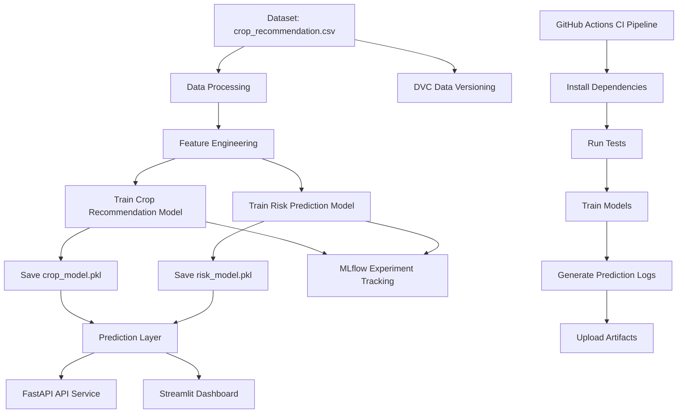

# Smart Crop Prediction & Risk Advisory System 🌾

## 📌 Project Overview
This project is an end-to-end mini MLOps system that predicts the most suitable crop based on soil nutrients and environmental conditions, and also estimates cultivation risk level with advisory suggestions.

It combines:
- **Machine Learning**
- **FastAPI**
- **Streamlit Dashboard**
- **GitHub Actions CI**
- **MLflow Experiment Tracking**
- **MLflow Model Registry**
- **Prediction Logging / Monitoring**

---

## 🎯 Objective
To build a smart agricultural decision support system that helps recommend crops using:
- Soil nutrients (**N, P, K**)
- Temperature
- Humidity
- pH
- Rainfall

The system also predicts:
- **Risk Level**
- **Advisory Recommendation**

---

## 🧠 Features
- Crop recommendation prediction
- Risk level prediction (Safe / Moderate Risk / High Risk)
- Advisory generation
- FastAPI backend for serving predictions
- Streamlit dashboard for user interaction
- Automated CI pipeline using GitHub Actions
- MLflow tracking and model registry
- Prediction logging for monitoring and traceability

---

## 🛠️ Tech Stack
- **Python**
- **Pandas**
- **Scikit-learn**
- **FastAPI**
- **Uvicorn**
- **Streamlit**
- **Pytest**
- **MLflow**
- **GitHub Actions**

---

## 📂 Project Structure

```text
mlops-project/
│
├── .github/
│   └── workflows/
│       └── ci.yml
│
├── app/
│   ├── api.py
│   └── app.py
│
├── data/
│   └── crop_recommendation.csv
│
├── logs/
│   └── prediction_history.csv
│
├── models/
│   ├── crop_model.pkl
│   └── risk_model.pkl
│
├── source/
│   ├── __init__.py
│   ├── data_processing.py
│   ├── train.py
│   └── predict.py
│
├── tests/
│   ├── conftest.py
│   ├── test_data_processing.py
│   └── test_prediction.py
│
├── requirements.txt
├── README.md
├── .gitignore
└── mlflow.db
```

---

## ⚙️ MLOps Workflow
This project follows a mini MLOps lifecycle:

1. **Data Loading**
2. **Data Validation**
3. **Feature Engineering**
4. **Model Training**
5. **Experiment Tracking with MLflow**
6. **Model Registration with MLflow Registry**
7. **Model Serving through FastAPI**
8. **Dashboard Interaction through Streamlit**
9. **Prediction Logging / Monitoring**
10. **Automated CI Pipeline using GitHub Actions**

---

## 🚀 How to Run Locally

### 1. Clone the repository
```bash
git clone <your-repo-url>
cd mlops-project
```

### 2. Create virtual environment
```bash
python -m venv venv
```

### 3. Activate virtual environment
#### Windows
```bash
venv\Scripts\activate
```

### 4. Install dependencies
```bash
pip install -r requirements.txt
```

### 5. Train the models
```bash
python -m source.train
```

### 6. Run FastAPI backend
```bash
python -m uvicorn app.api:app --reload
```

### 7. Run Streamlit dashboard
```bash
python -m streamlit run app/app.py
```

---

## 🔗 API Endpoints

### Health Check
```text
GET /health
```

### Prediction Endpoint
```text
POST /predict
```

---

## 📊 MLflow Usage

### Start MLflow UI
```bash
mlflow ui --backend-store-uri sqlite:///mlflow.db
```

### Open in browser
```text
http://127.0.0.1:5000
```

MLflow is used for:
- experiment tracking
- metrics logging
- artifact logging
- model registry

---

## 📈 Monitoring
Prediction requests are logged in:

```text
logs/prediction_history.csv
```

This supports:
- inference traceability
- usage monitoring
- future analysis

---

## 🤖 CI/CD with GitHub Actions
The project includes an automated CI workflow that:

- installs dependencies
- runs tests
- trains models
- performs sample prediction
- uploads artifacts

### Artifacts generated:
- trained models
- prediction logs
- MLflow files

---

## 🔄 Visual MLOps Project Pipeline



### 📌 Pipeline Explanation

1. **Dataset** is loaded from the crop recommendation CSV file.
2. **Data Processing** creates additional outputs such as:
   - risk level
   - advisory
3. **Feature Engineering** prepares the data for machine learning.
4. Two ML models are trained:
   - **Crop Recommendation Model**
   - **Risk Prediction Model**
5. Trained models are saved as:
   - `crop_model.pkl`
   - `risk_model.pkl`
6. The **Prediction Layer** is reused by:
   - FastAPI backend
   - Streamlit dashboard
7. **MLflow** tracks experiment runs, metrics, and registered models.
8. **DVC** versions the dataset.
9. **GitHub Actions** automates:
   - dependency installation
   - testing
   - training
   - prediction log generation
   - artifact upload

---

## 🧪 Testing
Run tests using:

```bash
python -m pytest
```

---

## 📌 Future Improvements
- DVC integration for full data/model versioning
- Docker containerization
- Cloud deployment
- Model drift monitoring
- Better dashboard analytics

---

## 👨‍💻 Author
Developed as an academic MLOps mini-project for smart agriculture use cases.